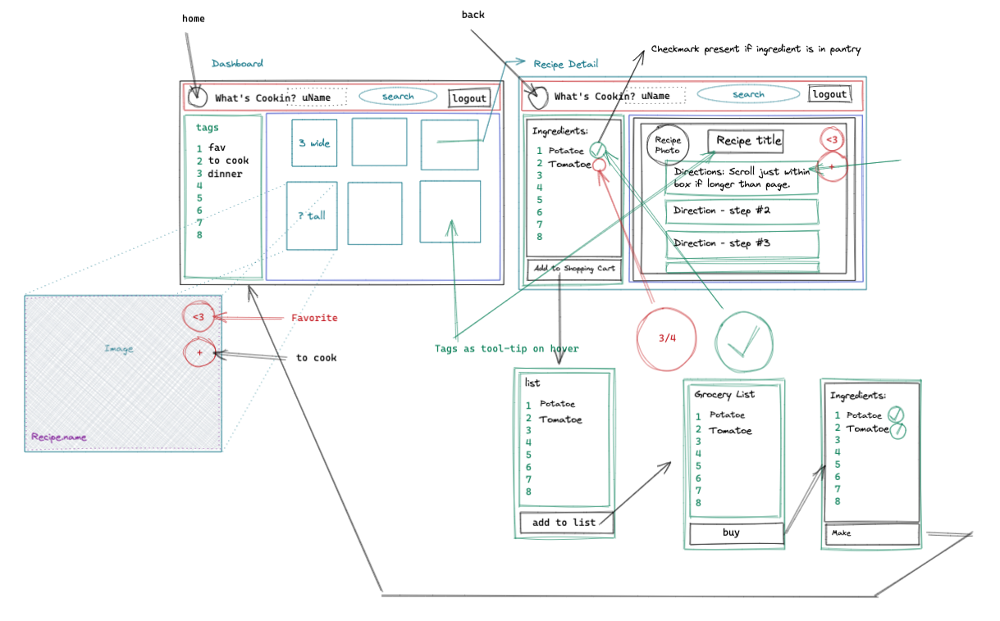

# Design Inspiration Choices

1. URL: https://www.allrecipes.com/
* Design our recipe cards to look similiar to all recipe cards. Clean favorite icon in the top right hand corner. Smaller pictures are better 

2. URL: https://www.foodnetwork.com/recipes/giada-de-laurentiis/peas-and-prosciutto-recipe2-1957117
* Design our ingredients and directions to sit side by side as in the example. This will enable to user to better refernce amounts while cooking. Potentially add in a scroll function just the directions if needed. Use green and red checkmarks next to items to indicate if you have the ingredients. Potentially checkmark over image to show if all ingredients are already in pantry. 

3. URL: https://www.tasteofhome.com/recipes/garlic-knots/

* Design our nav bar to be trailing and follow along with a scrolling. Keep the seach bar present so that the user can easily access it. 

# What's Cookin WireFrame

